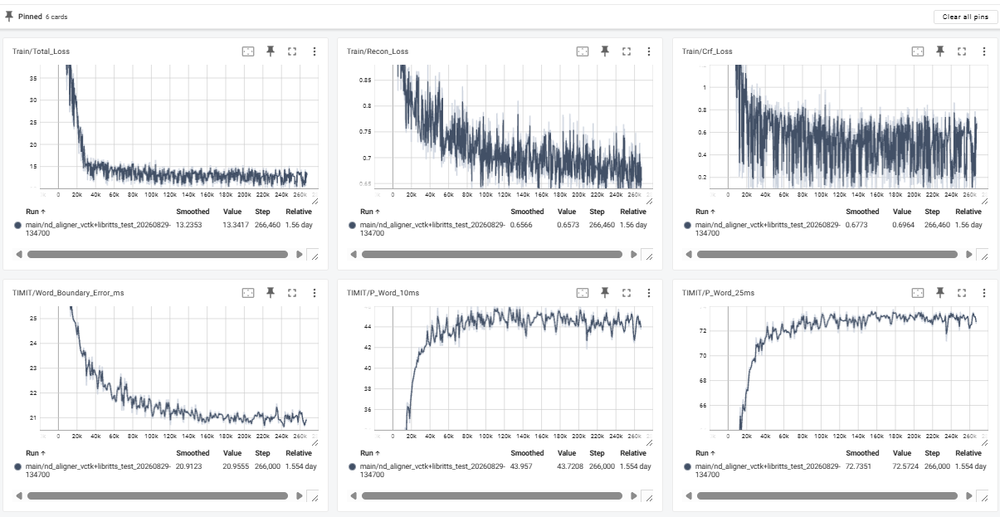
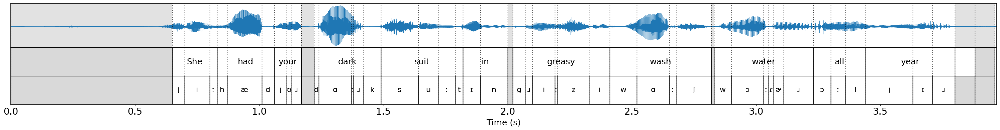

# ND-Aligner

A standalone neural forced aligner trained from paired speech and text, without frame-level boundary labels.

## Requirements

- Python 3.14
- CUDA GPU and the **CUDA toolkit, including `nvcc`** — see below
- A C compiler (`clang` or `gcc`)
- espeak-ng, for phonemization

```bash
git clone https://github.com/Rucious-Aladdin/ND-Aligner.git
cd ND-Aligner

sudo apt-get install espeak-ng
uv sync --locked

scripts/build_fb_kernel.sh
scripts/build_mas_dp.sh
```

### Compiled kernels

Two parts of the aligner are compiled rather than written in PyTorch.

The monotone forward–backward recursion is sequential over speech frames, so a PyTorch implementation has to launch one kernel per frame. This repository instead ships a CUDA extension (`nd_aligner/models/modules/forward_backward/`) that keeps the entire recursion in a single launch, with one block per batch item and threads parallelizing over the text axis. It also provides explicit backward kernels for both `log_alpha` and `log_beta`, which avoid atomics by gathering rather than scattering gradients. End to end this makes training about **7× faster**. Viterbi decoding has a smaller C helper (`nd_aligner/models/modules/mas/`).

PyTorch fallbacks exist for both and are selected automatically when a build is unavailable or when tensors are on CPU. They are there for reference and debugging; training on them is not practical.

`scripts/build_fb_kernel.sh` builds the CUDA extension. It resolves `CUDA_HOME` from the `nvidia-cu13` wheel installed by `uv sync`, so a system CUDA toolkit is not required, and it reads the target architectures from `nvidia-smi` unless `TORCH_CUDA_ARCH_LIST` is already set. Pass `--test` to run the kernel test suite
immediately after building:

```bash
scripts/build_fb_kernel.sh --test
```

`scripts/build_mas_dp.sh` compiles `viterbi_dp.c` into a shared library and loads it once to check the symbol. It uses `clang` if available and `gcc` otherwise; override with `CC` or adjust flags with `MAS_CFLAGS`:
```bash
CC=gcc MAS_CFLAGS="-O2" scripts/build_mas_dp.sh
```

If the CUDA build fails, check that `nvcc` is reachable and that its version matches the one PyTorch was built against:

```bash
nvcc --version
uv run python -c "import torch; print(torch.version.cuda)"
```

See `nd_aligner/models/modules/forward_backward/README.md` for what the kernels compute and how to call them, and the derivation note alongside it for the recursions and their gradients.

## Data preparation

LJSpeech, VCTK, and LibriTTS are supported for training; TIMIT and Buckeye are used for evaluation.

Point `DATA_PARENT_DIR` in `nd_aligner/config/ndaligner/data_config.py` at your data root, then:

```bash
uv run python -m nd_aligner.preprocess.preprocess_audio

# Required for multi-speaker training
uv run python -m nd_aligner.preprocess.preprocess_spk_embeddings
```

## Training

> **Training evaluates on TIMIT by default.** Every `train_time_eval_per_step` steps it aligns a held-out TIMIT subset, logs the
> word-boundary error, and keeps checkpoints by that metric. If you do not have TIMIT, set `train_time_eval_logging = False` in `ExperimentConfigs`
> (`nd_aligner/config/ndaligner/data_config.py`) before starting, or training will fail on the missing `timit_val_root_dir`. Training itself does not use
> TIMIT; the paths there are only for this monitoring.

```bash
uv run python -m nd_aligner.train.train
```

Configuration is read from JSON files; see `nd_aligner/config/` for the available fields.

Losses go to TensorBoard throughout training, along with the TIMIT word-boundary metrics when the evaluation above is enabled.



## Aligning speech

`notebooks/alignment_demo.ipynb` runs a checkpoint on a waveform and writes a Praat TextGrid with a word tier and a phone tier.



Word boundaries are recovered from the token sequence, so the phone tier carries the character-level IPA units the model aligns rather than a phone inventory.

## Evaluation

Baseline aligners are not vendored here. Each was run in its own environment and scored with the same procedure; the notebooks under `notebooks/baselines/` record how, and carry setup instructions at the top:

- `charsiu_en_w2v2_fc_10ms.ipynb`
- `maps_eval.ipynb`
- `mfa3_0.ipynb`

## License

MIT
